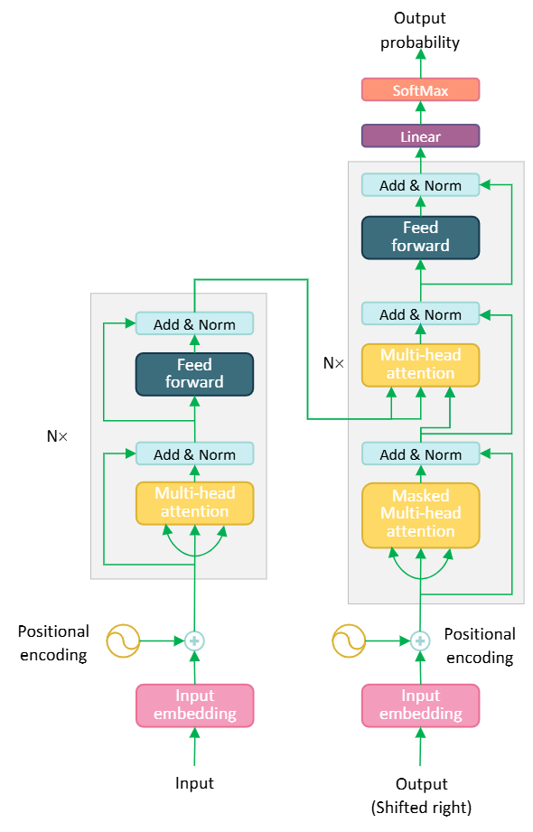

.. TransformerNNX documentation master file, created by
   sphinx-quickstart on Mon Dec 16 12:46:55 2024.
   You can adapt this file completely to your liking, but it should at least
   contain the root `toctree` directive.

TransformerNNX documentation
============================

**Ripository:** https://github.com/mohsenh17/TransformerNNX

===========================
**What are Transformers?**
===========================
Transformers are a class of deep learning models that revolutionized natural language processing (NLP) 
and other fields by introducing a highly effective mechanism called attention. 
Unlike earlier models such as recurrent neural networks (RNNs) and long short-term memory networks (LSTMs), 
transformers process input data in parallel, making them faster and more efficient, especially for 
long sequences. Since their introduction in "Attention is All You Need" :cite:`vaswani2017attention`, 
transformers have become the backbone of most state-of-the-art models in NLP, computer vision, and beyond.

Before transformers, sequence-to-sequence models relied on RNNs, which struggled with long-range 
dependencies and computational inefficiencies due to their sequential nature. 
Transformers addressed these issues by:

* Replacing recurrence with self-attention mechanisms.
* Allowing global dependencies within a sequence to be captured effectively.
* Utilizing parallel computation for faster training.

Transformers introduced the attention mechanism as a core component, enabling models to:

* Dynamically focus on the most relevant parts of the input sequence.
* Handle tasks like translation, summarization, and question answering with unparalleled performance.
* Scale to larger datasets and models, leading to breakthroughs like BERT, GPT, and T5.

-----------------------------------
**Core Ideas Behind Transformers**
-----------------------------------
**Attention Mechanism:**
At the heart of the transformer is the attention mechanism, which computes a 
weighted representation of the input sequence, allowing the model to focus on the most 
important tokens for a given task. Self-attention enables the model to understand relationships 
between words irrespective of their position in the sequence.

**Parallelism:**
Unlike RNNs, transformers process entire sequences simultaneously, leveraging GPUs and TPUs more effectively. 
This design eliminates the sequential bottleneck and significantly accelerates training and inference.

===========================================
**High-Level Transformer Architecture**
===========================================

The transformer architecture consists of two main components: the **encoder** and the **decoder**. 
Each plays a distinct role in sequence-to-sequence tasks like machine translation.

**Encoder:**

* The encoder takes an input sequence and converts it into a series of context-aware representations.
* It is composed of multiple identical layers, each containing two primary sublayers:

  * A multi-head self-attention mechanism.
  * A position-wise feedforward network.

**Decoder:**

* The decoder generates the output sequence by attending to the encoder’s representations and its own previously generated tokens.
* Like the encoder, it consists of stacked layers with three sublayers:

  * A masked multi-head self-attention mechanism (to ensure causal order).
  * A multi-head cross-attention mechanism (attending to the encoder’s outputs).
  * A position-wise feedforward network.

-------------------
**Flow of Data**
-------------------

1. **Input Representation:** 
   The input tokens are embedded into dense vectors, and positional encodings are added to 
   introduce information about the order of tokens.
2. **Encoder Processing:** 
   The input embeddings pass through the encoder layers, resulting in context-aware representations.
3. **Decoder Processing:** 
   The decoder uses the encoder’s outputs and previously generated tokens to produce the final sequence.
4. **Output Generation:** 
   The decoder’s outputs are passed through a linear layer and softmax function to generate 
   probabilities for the next token.

-------------------------------
**Diagram of the Transformer**
-------------------------------

--------------------------------
**Role of Attention Mechanism**
--------------------------------

* **Self-Attention**: 
   Helps encode contextual relationships within the same sequence 
   (e.g., understanding dependencies in a sentence).
* **Cross-Attention**: 
   Allows the decoder to align and extract relevant information from the encoder’s outputs.

----------------------------------
**Strengths of the Architecture**
----------------------------------

* **Scalability**: Handles large datasets and models efficiently.
* **Flexibility**: Extensible to tasks beyond NLP, such as vision and reinforcement learning.
* **Effectiveness**: Achieves state-of-the-art results in diverse tasks by capturing both local and global dependencies in data.

.. toctree::
   :maxdepth: 2
   :caption: Core Building Blocks

   api/Positional_encoding.ipynb

***************
Bibliography
***************

.. bibliography::
   :cited:
   :style: plain